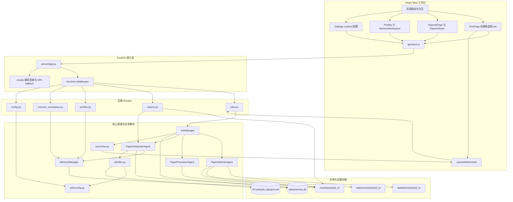
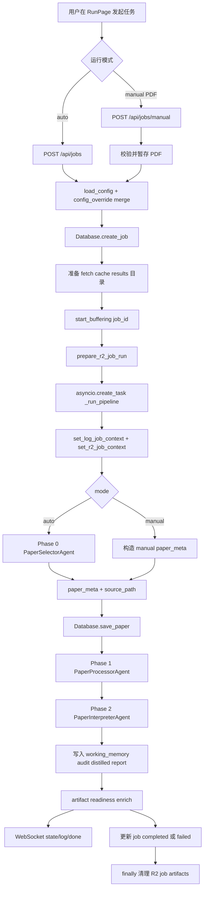
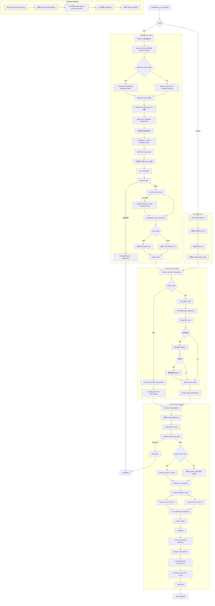
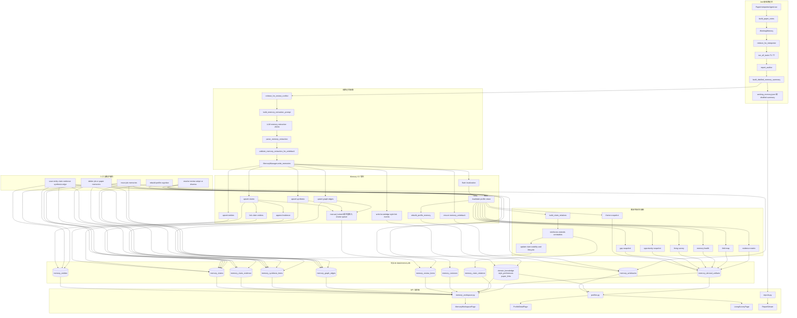

# Paper Agent

学术论文自动深度解读系统。给定论文 PDF 或 HTML 论文页，自动生成结构化中文 Markdown 解读，并通过 Web 工作台提供运行、报告、记忆、图谱和报告微调能力。当前为 **Web-only** 架构：FastAPI 后端 + React 前端。

> **公开仓库同步**：本项目有对应的开源仓库 `Paper-Agents-OSS`。同步方式见 `CLAUDE.md` 末尾的「公开仓库同步指南」。核心规则：**绝对不要把 master 分支直接推到公开仓库**，必须通过本地 `public` 孤儿分支中转。

## 0. Karpathy 风格工作原则

以下原则参考 `forrestchang/andrej-karpathy-skills`，并已经针对 Paper Agent 的仓库结构、运行语义和常见任务类型做了落地化。给 agent 的核心要求不是“写得多”，而是 **先想清楚、改得克制、围绕目标验证**。

### 0.1 Think Before Coding

- 先定位真实入口文件，再决定改哪里。不要看到症状就立刻改 UI 或改 prompt。
- 先确认当前需求影响的是哪一层：
  - source 获取 / 候选筛选 / topic-fit → `modules/paper_selector/*`、`utils/pdf_sources.py`、`utils/source_documents.py`
  - paper_notes / T1-T7 / report audit → `modules/paper_interpreter/*`
  - runtime settings / `.env` / browser override → `utils/config.py`、`server/app.py`、`server/routers/config.py`、`web/src/pages/SettingsPage.tsx`
  - 运行调度 / retry / rerun / force-stop / purge → `server/job_manager.py`、`server/routers/jobs.py`
- 遇到语义容易混淆的地方，先明确当前系统约定，再下手：
  - `retry` = 原地重试同一个 `job_id`
  - `rerun` = 新建 replacement job
  - `profile_mode=auto` ≠ `default`
  - HTML source ≠ PDF fallback 文件
  - Run 页 override ≠ 修改全局 `config.yaml`
- 若用户方案会破坏已有不变量，先指出风险，优先给出更简单的替代路径。

### 0.2 Simplicity First

- 默认选择最小可行改动，不为了“以后可能更通用”提前引入新 abstraction。
- 优先复用现有 helper、schema、artifact 和页面状态流，而不是再造一套并行机制。
- 不随手新增配置项、持久化层、上下文 provider、router endpoint，除非现有结构无法承载需求。
- 对 agent 任务的判断标准不是“看起来架构更优雅”，而是：
  - 是否更容易验证
  - 是否更容易回归排查
  - 是否更贴近当前仓库的真实数据流

### 0.3 Surgical Changes

- 每一处 diff 都应直接服务于当前需求。
- 不做与任务无关的顺手重构、命名统一、目录整理、注释重写或格式化漂移。
- 只清理由本次改动引入的残留：
  - 新增后又没用上的 import / state / helper 要删
  - 早就存在但与当前任务无关的问题，只记录，不顺手修
- 触碰高耦合文件时，优先沿用当前模块边界，不把逻辑从一个层随意搬到另一个层。

### 0.4 Goal-Driven Execution

- 非平凡任务默认遵循：**定位 → 最小实现 → 验证 → 交付**
- 对每类修改至少选一个最贴近的验证动作：
  - 前端交互 / 状态流 / API client 改动：`cd web && npm run build`
  - runtime config / `.env` / header / mode 切换：优先看 `tests/test_runtime_config.py`
  - selector / source 获取 / HTML 支持：优先看 `tests/test_paper_selector_regressions.py`、`tests/test_html_source_support.py`、`tests/test_topic_enrichment.py`
  - memory schema / relation / opportunity / provenance 改动：优先看 `tests/test_memory_v3_schema_migration.py`、`tests/test_memory_v3_claim_relations.py`、`tests/test_memory_v3_opportunity_routes.py`
  - profile routing / move / purge / memory 删除：优先看 `tests/test_profile_assignment.py`、`tests/test_profile_move.py`、`tests/test_job_purge_and_memory_delete.py`
  - report audit / memory artifacts：优先看 `tests/test_report_auditor.py`、`tests/test_report_memory_artifacts.py`
- 如果环境缺依赖导致无法验证，要在最终说明中明确写出未运行的检查与原因。

### 0.5 Changelog Discipline

- 每次**大规模更新**完成后，必须在仓库根目录的 `ChangeLogs/` 下**新增**一份 changelog。
- 文件名格式固定为 `YY-MM-DD.md`，例如 `26-01-01.md`。
- 这里的“大规模更新”包括但不限于：
  - 新功能或新架构落地
  - 跨后端 / 前端 / 数据层的联动改动
  - memory schema / pipeline / runtime / deletion semantics 的重要变更
  - 真实 LLM 验证后需要记录行为变化的更新
- changelog 至少要写清楚：
  - 背景与目标
  - 影响范围（主要文件 / 模块）
  - 核心改动
  - 数据结构 / API / 页面变化
  - 验证结果（测试、build、真实 API 烟测）
  - 兼容性 / 迁移约束
  - 是否清理了临时产物
- changelog 以“帮助后续 agent 和人快速回顾这次变更”为目标，重点写 why / impact / validation，不要只罗列文件名。

## 1. 快速启动

```bash
# 后端（端口 10086）
conda activate P-Agent && python run.py

# 前端开发
cd web
npm run dev

# 前端构建（生产态由 FastAPI 直接托管 web/dist）
cd web
npm run build
```

## 2. 核心管道

```text
Web UI → /api/* → JobManager
  │
  ├─ auto 模式:
  │   PaperSelectorAgent
  │     ├─ venue-first / general search
  │     ├─ DOI / arXiv / title 去重
  │     ├─ rerank（embedding + lexical blended score）
  │     ├─ PDF URL enrichment（DOI / landing page / HTML probe）
  │     ├─ AIC enrichment
  │     ├─ topic-fit gate（不合题候选直接淘汰）
  │     └─ LLM Top-1 精选 + 下载 source（优先 PDF，拿不到时保留 HTML）
  │
  ├─ manual 模式:
  │   上传 PDF → 复制到 job fetch 目录
  │
  ├─ Phase 1: PaperProcessorAgent
  │   └─ PDF 走图表识别 / 裁剪 / 兜底提取；HTML 走正文抽取 / html_bundle
  │
  └─ Phase 2: PaperInterpreterAgent
      ├─ build_paper_notes（共享结构化笔记）
      ├─ selected paper topic audit（二次纠偏）
      ├─ auto profile routing（match / create）
      ├─ Memory retrieval bundles 注入
      ├─ WorkingMemory 初始化
      ├─ Group A: T1 → T5 → T6
      ├─ Group B: T2 → T3 → T4
      ├─ T7 总结与术语表
      ├─ ReportAuditor（groundedness / consistency / repair）
      ├─ distillation + promotion
      ├─ memory extraction validation（无证据 / audit removed claim 过滤）
      ├─ Memory V3 writeback（claims / evidence / synthesis / provenance）
      ├─ claim relation rebuild（reinforces / extends / contradicts + lifecycle）
      ├─ theme / gap / opportunity / health / field map / evidence matrix 派生视图刷新
      ├─ assembler → report.en.md → report.md
      ├─ localized memory artifacts 预生成
      └─ report_refiner → variants/*.md
```

## 3. 目录结构

```text
Paper-Agent/
├── README.md                        # 面向用户的总览文档
├── AGENTS.md                        # 面向 agent 的高密度仓库导航
├── CLAUDE.md                        # Claude/Codex 风格协作文档
├── ChangeLogs/                      # 大版本 / 重要跨层更新记录（按 YY-MM-DD.md 命名）
├── run.py                           # Web 启动入口（uvicorn, port 10086）
├── config.yaml                      # 默认运行配置（topics / selection / models / report / storage）
├── requirements.txt                 # Python 依赖
├── .env                             # 服务器内置 runtime source 之一（可选密码保护）
│
├── server/                          # FastAPI 后端
│   ├── app.py                       #   路由挂载、SPA fallback、startup stale-job reconcile + R2 stale multipart cleanup
│   ├── database.py                  #   SQLite jobs / papers 持久化
│   ├── job_manager.py               #   create / retry / rerun / delete / force-stop / purge 主控 + R2 job context / remote cleanup
│   ├── job_summaries.py             #   Reports / History 诊断摘要组装 + enrich_job_with_artifact_readiness
│   ├── ws.py                        #   WebSocket 日志广播（ContextVar 隔离 + per-job early-log buffer）
│   ├── deps.py                      #   全局 Database 依赖注入
│   ├── schemas.py                   #   Pydantic 模型（JobResponse 含 has_working_memory 等 artifact readiness 字段）
│   └── routers/
│       ├── config.py                #     GET / PUT /api/config、runtime settings、env unlock challenge / verify
│       ├── jobs.py                  #     job CRUD、cancel / retry / rerun / delete / force-stop、WS、stats、papers
│       ├── profiles.py              #     profile CRUD、detail、brief、living survey、profile delete、按 job / paper 删除 memory、批量迁移 paper bundle
│       ├── memory_workspace.py      #     workspace snapshot、entity / claim / evidence / synthesis / graph / review CRUD
│       └── reports.py               #     report 列表 / 内容 / assets / variants / localized artifacts
│
├── modules/
│   ├── paper_selector/
│   │   ├── agent.py                 #     主调度：dedupe / rerank / AIC / Top-1 / download
│   │   ├── fetcher.py               #     多源检索（ArXiv / S2 / DBLP / OpenAlex / OpenReview）
│   │   ├── reranker.py              #     embedding 重排 + lexical fallback
│   │   ├── selector.py              #     LLM 精选（仅在 selectable candidates 中选）
│   │   └── aic.py                   #     候选信息补充（ar5iv / PDF）
│   ├── paper_processor/
│   │   └── agent.py                 #   Phase 1: 图表识别 / 裁剪 / 提取
│   └── paper_interpreter/
│       ├── agent.py                 #   Phase 2 主控（on_progress callback 通知 artifact 落盘）
│       ├── task_runner.py           #     paper_notes + T1-T7 分组执行
│       ├── dual_model.py            #     双模型并发裁决
│       ├── report_auditor.py        #     报告 groundedness / consistency 审查与修复
│       ├── working_memory.py        #     job 级短期记忆
│       ├── distillation.py          #     promotion distillation
│       ├── assembler.py             #     Markdown 组装 / figure placement / repo metadata
│       ├── translator.py            #     报告翻译 + Memory 中文翻译
│       └── report_refiner.py        #     grounded report variants（ReAct-style refinement）
│
├── utils/
│   ├── config.py                    #   配置加载（server .env / browser runtime override / env unlock / config.yaml）
│   ├── llm.py                       #   统一 LLM 调用（文本 / PDF / 图像 / runtime-config-aware job-scoped R2 / transport fallback / 重试 / deadline / multipart cleanup）
│   ├── memory.py                    #   MemoryManager (Memory V3 核心)：schema / writeback / theme / gap / opportunity / health / field map / evidence matrix / provenance
│   ├── memory_claim_relations.py    #   Claim relation 纯函数：reinforces / extends / contradicts + stability / lifecycle stats
│   ├── memory_opportunities.py      #   Opportunity 纯函数：从 theme / gap / relation / review 派生研究机会
│   ├── profile_assignment.py        #   auto profile match / auto create
│   ├── job_paths.py                 #   job 级路径生成
│   ├── pdf_parser.py                #   PyMuPDF 图片提取
│   ├── pdf_sources.py               #   DOI / landing page / HTML probe PDF URL enrichment
│   ├── source_documents.py          #   source 下载、HTML redirect follow、HTML 正文提取
│   ├── markdown.py                  #   classic / pmrc Markdown 组装
│   ├── report_styles.py             #   report structure / detail helpers
│   ├── embedding.py                 #   embedding 计算
│   ├── working_memory_localization.py # working memory 本地化
│   ├── logger.py                    #   日志
│   ├── repo_paths.py                #   仓库路径
│   ├── arxiv_api.py                 #   ArXiv API
│   ├── semantic_scholar.py          #   Semantic Scholar API
│   ├── openreview.py                #   OpenReview API
│   ├── openalex.py                  #   OpenAlex API
│   └── dblp.py                      #   DBLP API
│
├── web/
│   ├── README.md                    #   前端开发说明
│   ├── package.json
│   └── src/
│       ├── App.tsx                  #   路由定义
│       ├── main.tsx                 #   React 入口
│       ├── api/client.ts            #   API 封装 + 前端类型
│       ├── lib/
│       │   ├── utils.ts             #     cn() className 合并
│       │   ├── jobConfig.ts         #     Run 页 session 持久化与 config 归一化
│       │   ├── localizedText.ts     #     本地化上下文 / 语言解析（非组件逻辑）
│       │   ├── formatters.ts        #     共享纯函数：formatDate / clipText
│       │   └── reportDiagnostics.ts #     共享纯函数：readDiagnosticNumber / readPromotionCount
│       ├── hooks/useJobWebSocket.ts #   作业状态 + 日志订阅 + LogEntry 类型
│       ├── components/
│       │   ├── Layout.tsx           #     左侧导航
│       │   ├── LogStream.tsx        #     日志流
│       │   ├── JobHistoryCard.tsx   #     Reports 历史卡片
│       │   ├── CreateProfileDialog.tsx
│       │   ├── DeleteProfileDialog.tsx
│       │   ├── KeywordTokenInput.tsx
│       │   ├── LocalizedTextBlock.tsx #    本地化文本展示组件
│       │   ├── LocalizedTextLanguageProvider.tsx #  语言上下文 Provider
│       │   ├── MemoryGraphCanvas.tsx
│       │   └── ui/                  #     button / card / dialog / badge / info-hint 等
│       └── pages/
│           ├── Dashboard.tsx
│           ├── RunPage.tsx          #     启动作业、实时日志、working memory 预览
│           ├── ReportsPage.tsx
│           ├── ReportViewer.tsx     #     报告查看、artifact panels、report refinement
│           ├── PapersPage.tsx
│           ├── ProfilesPage.tsx
│           ├── ProfileDetailPage.tsx
│           ├── LivingSurveyPage.tsx #     profile 维度的 Living Survey / 阅读路径与来源追溯
│           ├── SettingsPage.tsx     #     浏览器本地 provider / key / model alias / 默认 run config 设置
│           └── MemoryWorkspacePage.tsx
│
├── tests/
├── scripts/
├── specs/
├── docs/
├── data/
│   ├── memory.db                    # SQLite 共用库（memory + jobs + papers）
│   ├── runtime_config.yaml          # 服务器侧运行时配置接口存储（当前执行链路默认不回落依赖）
│   └── fetch/jobs/{job_id}/         # job 级 source 存储（PDF 或 HTML）
└── results/jobs/{job_id}/           # 报告、variants、assets、working_memory 等
```

## 4. 前端路由

| 路由 | 页面 | 说明 |
|------|------|------|
| `/` | Dashboard | 统计 + 最近报告 |
| `/run` | RunPage | 启动作业、显式 profile 选择或 Auto assign、report structure、实时日志 |
| `/reports` | ReportsPage | 全量 job 历史、诊断卡片、failed retry / run again、展开卡片内 Delete |
| `/reports/job/:jobId` | ReportViewer | 报告查看 + working memory / distilled summary / selector diagnostics / report audit / variants |
| `/papers` | PapersPage | 已入库论文 + PDF / HTML source 打开 |
| `/profiles` | ProfilesPage | Profile 列表管理 |
| `/profiles/:profileId` | ProfileDetailPage | Profile 概览 + brief + health / field map / theme / gap / opportunity preview + survey 状态 + rebuild + profile 删除 + memory 删除 + 批量迁移 paper bundle |
| `/profiles/:profileId/survey` | LivingSurveyPage | 面向阅读的动态领域综述，含阅读路径、章节用途说明和来源追溯 |
| `/profiles/:profileId/workspace` | MemoryWorkspacePage | 知识库 / 健康度 / 领域地图 / 证据矩阵 / 主题 / 空白 / 机会 / 图谱 / 时间线 / 冲突 / 修订 |
| `/settings` | SettingsPage | 实例级 API key / provider / model alias / 默认 run config 设置 |

## 5. 后端 API 速查

| 分组 | 关键接口 |
|------|---------|
| **config** | `GET/PUT /api/config`, `GET/PUT /api/config/runtime`, `POST /api/config/runtime/env-unlock/challenge`, `POST /api/config/runtime/env-unlock/verify` |
| **jobs** | `POST /api/jobs`, `POST /api/jobs/manual`, `GET /api/jobs/history`, `GET /api/jobs/{id}`, `DELETE /api/jobs/{id}`, `POST /api/jobs/{id}/cancel`, `POST /api/jobs/{id}/retry`, `POST /api/jobs/{id}/rerun`, `POST /api/jobs/{id}/force-stop`, `WS /api/jobs/{id}/ws` |
| **topics** | `POST /api/topics/keyword-candidates` |
| **stats** | `GET /api/stats`, `GET /api/papers`, `GET /api/papers/{id}/pdf` |
| **profiles** | `GET/POST /api/profiles`, `DELETE /api/profiles/{id}`, `GET /api/profiles/{id}/brief`, `GET /api/profiles/{id}/detail`（含 `health`、`field_map_preview`、`opportunity_preview`、`survey_meta`）, `POST /api/profiles/{id}/rebuild`, `POST /api/profiles/{id}/move-papers`, `DELETE /api/profiles/{id}/jobs/{jid}/memory`, `DELETE /api/profiles/{id}/papers/{paper_id:path}/memory` |
| **workspace** | `GET /api/profiles/{id}/workspace`，以及 overview / curated / themes / gaps / opportunities / health / field-map / evidence-matrix / entities / claims / evidence / synthesis / graph / reviews / revisions / timeline CRUD |
| **reports** | `GET /api/reports/jobs`, `GET /api/reports/jobs/{id}`, `POST /api/reports/jobs/{id}/refine`, `GET /api/reports/jobs/{id}/artifacts/{artifact}`（含 `report-audit`）, `GET /api/reports/jobs/{id}/working-memory-localized`, `GET /api/reports/jobs/{id}/distilled-summary-localized`, `GET /api/reports/jobs/{id}/assets/{path}` |

## 6. Memory V3 速查

**Profile 是隔离边界**。每个 profile 独立拥有：

| 层 | 对象 | 说明 |
|----|------|------|
| 1 | entity | 稳定概念节点（方法 / 数据集 / 指标等） |
| 2 | claim | 中层结论（finding / comparison / limitation / hypothesis / open_question） |
| 3 | evidence | claim 的证据锚点（section / page / anchor_kind / structured_signal） |
| 4 | synthesis | 高层认知（consensus / debate / evolution） |
| 5 | review / revision | 冲突裁决 + 修改历史 |
| 6 | derived views | theme / gap / opportunity / brief / living survey / health / field map / evidence matrix |

### 6.1 V3 新增结构

- **claim scope**：claim 现在显式携带 `scope_json`，用于表达适用条件、边界、任务 / 数据分布与补充说明。
- **claim relation**：V3 会在 writeback 后基于 claim 文本、entity overlap、stance 和 evidence / review 状态，派生出 `reinforces / extends / contradicts`。
- **stability + lifecycle**：每条 claim 会维护 `stability_score`、`last_supported_at`、`last_challenged_at`、`lifecycle_state`、`lifecycle_reason_json`，当前自动规则主要产生 `emerging / supported / contested / needs_review`。
- **structured evidence**：evidence 除 snippet 外，还可包含：
  - `anchor_kind`：如 `table` / `figure` / `metric` / `result` / `claim`
  - `context_before` / `context_after`
  - `structured_signal_json`：如 `task / method / dataset / metric / value / baseline / comparator / setting / limitation / scope_note`
- **opportunity layer**：V3 从已有 memory 中派生只读 `opportunity_snapshot`，用于暴露最值得继续验证的研究机会。
- **governance views**：V3 额外派生 `memory_health_snapshot`、`field_map_snapshot`、`evidence_matrix_snapshot`，分别用于治理问题检查、领域结构理解和横向证据比较。

### 6.2 V3 代码结构

- `utils/memory.py`
  - Memory 主数据层与 schema migration
  - writeback validation / localization / provenance / rebuild
  - theme / gap / opportunity / health / field map / evidence matrix / brief / living survey / workspace snapshot 聚合
- `utils/memory_claim_relations.py`
  - claim relation 的纯函数构建
  - 根据 overlap、entity、stance 生成 `reinforces / extends / contradicts`
  - 输出 stability 与 lifecycle 相关统计
- `utils/memory_opportunities.py`
  - 从 theme / gap / claim_relations / reviews 派生 `opportunity_snapshot`
  - 当前为确定性规则，不依赖额外 LLM
- `server/routers/memory_workspace.py`
  - 暴露 workspace overview / curated / themes / gaps / opportunities / health / field-map / evidence-matrix / raw objects
- `server/routers/profiles.py`
  - 在 profile detail 中暴露 `health`、`field_map_preview`、`opportunity_preview`、`survey_meta`
- `web/src/pages/ProfileDetailPage.tsx`
  - 展示 Domain Brief、Memory Health preview、Field Map Preview、Living Survey 状态、Theme / Gap / Opportunity preview 与 paper bundle 管理
- `web/src/pages/MemoryWorkspacePage.tsx`
  - 按 `先读懂领域`、`查证据与问题`、`高级审计` 分组展示知识库、健康度、领域地图、证据矩阵、主题、空白、机会、图谱、时间线、审阅与修订
- `web/src/pages/LivingSurveyPage.tsx`
  - 展示阅读路径、章节用途说明、来源追溯 details，并把内部 theme/gap key 格式化为可读标签

### 6.3 关键机制

关键机制：

- **检索 bundle**：`for_selector`、`for_interpreter`、`for_review_conflict`、`for_translation_style`
- **写入前校验**：`write_memories()` 前先做 distillation 与 `validate_memory_extraction_for_writeback()`；无 evidence snippet 或已被 `report_audit` 移除的 claim 不进入长期事实层，synthesis 中指向被丢弃 claim 的链接会被剥离
- **懒迁移**：schema 采用 lazy migration + on-demand rebuild；V3 迁移失败不应阻断既有 V2 主功能
- **软锁**：人工编辑标记 `manual_locked`，AI 不直接覆盖，改走 review queue
- **双语**：英文 source-of-truth，中文为展示层；编辑英文后自动重译中文
- **provenance**：`memory_writebacks` 连接 profile + job + paper，支持按 job / paper 删除 bundle
- **关系派生**：claim relation 派生后会回写 claim stability，并驱动摘要层排序
- **健康度派生**：`memory_health_snapshot` 基于数据库确定性统计 unsupported / thin evidence / contested / pending review / scope incomplete / stale artifact 等问题，不调用 LLM
- **领域地图派生**：`field_map_snapshot` 从 themes、claims、claim relations 和 review 状态构造领域簇、簇关系和阅读入口，是只读视图
- **证据矩阵派生**：`evidence_matrix_snapshot` 按 `task / dataset / metric` 聚合 evidence，并标记 method / value / setting / scope 等缺失字段
- **机会派生**：当前 `innovation / hypothesis` 相关能力第一版为**只读 derived opportunity**，不是新的可编辑 source-of-truth，也不是 research task 系统
- **迁移**：Profile 间批量转移文章时，按 job bundle 迁移 provenance、claims、synthesis、graph 和 entity 引用，然后重建 source / target cognition

数据层：`utils/memory.py` → `data/memory.db`

## 7. 配置系统

### config.yaml 核心块

- `topics[]`: `{name, query, keywords[]}`
- `selection`: `{track, candidate_pool_size, date_range_days, classic_min_citations, semantic_top_k, min_semantic_score, preferred_venues[], preferred_institutions[]}`
- `models`: `{fast, primary, secondary, merge_model, reasoning_effort}`
- `report`: `{structure_mode}`，当前支持 `classic | pmrc`
- `output`, `storage`

### Run 页 ≠ 全局配置

Run 页只提交当前 job 的 `config_override`，不改写 `config.yaml`。JobManager 会 merge 后存入 `jobs.config_snapshot`。

### Runtime Settings

- `/settings` 当前支持两种运行时来源：
  - 服务器内置 `.env`
  - 浏览器本地 runtime settings（仅当 `ENV_RUNTIME_ACCESS_GUARD=password` 时启用）
- 浏览器本地 runtime settings 保存在**当前浏览器的 localStorage**，并通过请求头把 override 传给后端；若 guard 不是 `password`，后端会忽略这些 override 并继续使用服务器 `.env`
- 执行链路会按统一优先级自动选择来源：
  - `ENV_RUNTIME_ACCESS_GUARD=off`：一律只用服务器 `.env`
  - `ENV_RUNTIME_ACCESS_GUARD=password` 且当前浏览器已解锁：优先用服务器 `.env`
  - `ENV_RUNTIME_ACCESS_GUARD=password` 且当前浏览器未解锁：优先回落到当前浏览器的 runtime settings；若浏览器也没有 override，请求才会失败
- 当前可配：
  - OpenAI-compatible base URL / API key
  - Lite base URL / API key
  - Embedding base URL / API key / model
  - Semantic Scholar / MinerU key
  - R2 endpoint / bucket / access keys / public URL
  - 模型别名：`gpt_pro` / `gem_pro` / `gem_flash` / `gem_image` / `lite_model`
- 浏览器中已存储 secret 在 UI 中只显示遮罩态；留空表示保留当前浏览器里的原值，显式 clear 才会清空
- 服务器 `.env` 访问保护已独立成 access guard：默认 `ENV_RUNTIME_ACCESS_GUARD=off`，对外部署时可切到 `password`；只有 guard 打开后，`ENV_RUNTIME_PASSWORD_HASH` 才会生效，browser runtime 也才会被后端启用，用户也才需要先在 `/settings` 输入明文密码解锁；前端发送的是 derived proof，不是明文密码
- 这是**浏览器本地隔离**方案：不同浏览器可以携带不同配置；但只有在 browser runtime 已启用时，这些配置才会参与实际运行

## 8. 技术栈

| 层 | 技术 |
|----|------|
| 后端 | Python 3.11+, FastAPI, SQLite, boto3, openai, httpx, PyMuPDF |
| 前端 | React 19, TypeScript, Vite, Tailwind CSS v4, @xyflow/react, react-router-dom, react-markdown |

## 9. 问题定位速查

| 问题类型 | 优先排查文件 |
|---------|------------|
| 配置 | `config.yaml` / server `.env` / browser-local runtime settings → `utils/config.py` → `server/app.py` middleware → `web/src/pages/SettingsPage.tsx` |
| 运行调度 / retry / rerun / purge | `server/job_manager.py` → `server/routers/jobs.py` |
| 自动选论文 | `modules/paper_selector/fetcher.py` → `reranker.py` → `selector.py` → `agent.py` |
| PDF 下载源丢失 | `utils/pdf_sources.py` → `modules/paper_selector/agent.py` |
| 图表提取 | `modules/paper_processor/agent.py` |
| 解读质量 | `modules/paper_interpreter/task_runner.py` → `dual_model.py` → `agent.py` |
| 报告组装 / 翻译 | `modules/paper_interpreter/assembler.py` → `translator.py` |
| 报告结构 / 报告微调变体 | `utils/report_styles.py` → `modules/paper_interpreter/report_refiner.py` → `web/src/pages/ReportViewer.tsx` |
| Memory 数据 / schema / writeback | `utils/memory.py` |
| Memory claim relation | `utils/memory_claim_relations.py` → `utils/memory.py` |
| Memory opportunity | `utils/memory_opportunities.py` → `utils/memory.py` → `server/routers/memory_workspace.py` |
| Memory health / field map / evidence matrix | `utils/memory.py` → `server/routers/memory_workspace.py` → `web/src/pages/MemoryWorkspacePage.tsx` |
| Memory API | `server/routers/memory_workspace.py` → `server/routers/profiles.py` |
| Memory 页面 | `web/src/pages/MemoryWorkspacePage.tsx` → `web/src/pages/ProfileDetailPage.tsx` → `web/src/pages/LivingSurveyPage.tsx` |
| Run 页状态 / session | `web/src/pages/RunPage.tsx` → `web/src/lib/jobConfig.ts` |
| 前端本地化文本 | `web/src/lib/localizedText.ts` → `web/src/components/LocalizedTextBlock.tsx` → `web/src/components/LocalizedTextLanguageProvider.tsx` |
| 前端格式化 / 诊断 | `web/src/lib/formatters.ts` → `web/src/lib/reportDiagnostics.ts` |
| 日志不到前端 / Run 页开头日志缺失 | `server/ws.py`（early-log buffer / subscribe replay）→ `server/routers/jobs.py`（WS replay）→ `web/src/hooks/useJobWebSocket.ts` |
| R2 PDF 复用 / 远端拉取失败 / 新 job 仍命中旧对象 | `utils/llm.py`（job-scoped object key / pre-signed fallback / legacy key cleanup / multipart cleanup）→ `server/job_manager.py`（R2 context / purge cleanup） |
| R2 multipart 残留 / 上传后 PDF 损坏 | `utils/llm.py`（`put_object` 单次上传 / `_abort_incomplete_multipart_uploads` / `cleanup_stale_multipart_uploads`）→ `server/app.py`（startup cleanup） |
| selector / working memory / distilled summary 面板 | `server/routers/reports.py` → `web/src/pages/ReportViewer.tsx` |
| Reports 删除 / 清理不彻底 / Delete 卡住 | `web/src/pages/ReportsPage.tsx` → `web/src/components/JobHistoryCard.tsx` → `server/routers/jobs.py` → `server/job_manager.py` → `utils/memory.py` |
| artifact 轮询 404 / readiness | `server/job_summaries.py`(`enrich_job_with_artifact_readiness`) → `server/job_manager.py`(`_publish_job_state`) → `web/src/pages/RunPage.tsx`(轮询 guard) |

## 10. 关键设计约定

1. **Job 隔离**：每个 job 的 source 文档（PDF 或 HTML）、报告、variants、assets、working_memory 都在各自 `{job_id}` 目录下。
2. **Run-scoped override**：Run 页修改只影响本次运行，不改全局配置。
3. **Auto selector 采用 precision-first**：候选先做 blended rerank，再做 topic-fit gate；只有 source 可获取且通过 fit 审核的候选才会进入最终精选。若 topic 缺少英文关键词，后端会先自动补 search hints。
4. **Source 优先级**：selector 会优先跟随 landing page 内的真实 PDF；若来源实际只提供 HTML，则后续 processor / interpreter 会走 HTML 提取链路，不会把 HTML 冒充成 PDF。
5. **T1-T7 分组并行**：Group A (`T1→T5→T6`) 与 Group B (`T2→T3→T4`) 并行，T7 汇总。
6. **Auto profile routing**：未显式指定 profile 时，job 使用 `profile_mode=auto`；`default` 不会被自动选中，只会在用户显式指定时使用。当前路由会构建中英双语 fingerprint，并结合 embedding + 规则分数做跨语言匹配。
7. **报告审查先于写回**：T1-T7 完成后先做 `report_audit.json`，必要时保守修复，再写回 memory 和组装最终报告。
8. **翻译链路**：`report.en.md` → 中文首译 → review pass；memory artifacts 同理有本地化缓存。
9. **Retry / Rerun / Delete / Force-stop 语义不同**：
   - `retry`：failed job 原地重试，沿用同一个 `job_id`
   - `rerun` / ReportViewer `Regenerate`：新建 replacement job，成功后清理旧 job（含旧 artifacts、papers 记录与该 job 写回的 memory）
   - `delete`：面向历史 job 的显式删除，清理 job 记录、papers 记录、results/fetch/cache 目录，以及该 job 写回的 memory；Reports 页使用 5s 确认弹窗触发 `DELETE /api/jobs/{job_id}`
   - `force-stop`：强停并 purge job 记录、artifacts、fetch dir、cache dir 和该 job 写回的 memory
10. **Profile 批量迁移是 bundle move**：Profile Detail 的批量迁移不只是改 job 归属；它会连同 writeback / claims / synthesis / graph / entity 引用一起迁走，并在 source / target 两边重建长期记忆。
11. **Settings 页支持双运行时模式**：浏览器可以显式切到服务器 `.env` 或 browser-local runtime；系统不会在这两者之间偷偷回落。若启用 `ENV_RUNTIME_ACCESS_GUARD=password`，还需要先完成 env unlock。
12. **报告结构模式**：`classic` 与 `pmrc` 都落在 assembler / markdown 层，Report Viewer refinement 也能切换结构。
13. **Report variants**：微调版本保存在 `results/jobs/{job_id}/variants/*.md|*.json`，原稿仍保留为 `original`。
14. **WebSocket 日志**：基于 ContextVar 按 job_id 隔离，断线自动重连，服务重启时可识别 stale job。
15. **人工软锁**：用户手编 memory 后 AI 不直接覆盖，改走 review queue。
16. **Artifact readiness 推送**：`JobResponse` 和 WS state 推送均包含 `has_working_memory` / `has_selector_diagnostics` / `has_distilled_memory_summary` 标志（由 `enrich_job_with_artifact_readiness()` 注入）。Interpreter 每次落盘 `working_memory.json` 后通过 `on_progress` callback 触发 `_publish_job_state()`，前端 RunPage 仅在对应 artifact ready 后才开始轮询。
17. **Delete 清理链路必须保持纯本地**：job / paper / memory 删除流程只允许做数据库与文件系统清理，不应依赖 LLM/翻译调用；否则会把 Reports 页 Delete 卡在 `Deleting...`。
18. **Run 页日志必须覆盖启动初期**：pipeline task 在 `_spawn_pipeline_task()` 前就为该 job 开启 `server/ws.py` 的 per-job log buffer；WebSocket 连接建立后先回放缓冲日志，再进入 live queue。
19. **R2 PDF 必须按 job 隔离，而不是按 PDF 内容复用**：`utils/llm.py` 使用 `jobs/{job_id}/paper.pdf` 作为远端对象键；只有 `retry` 因为沿用同一个 `job_id`，才允许复用同一个远端槽位。
20. **历史哈希对象不能继续污染新 job**：旧版本使用 `papers/{digest}` / `papers/{digest}-{nonce}` 这类按 PDF 哈希命名的 R2 key；当前新 job 上传前会先清理同 PDF 的 legacy key 前缀。
21. **R2 PDF 远端错误要切换传输策略，而不是仅靠本机 probe**：当模型返回 `The document has no pages`、`failed to download`、`url_unreachable` 等远端 PDF 错误时，必须切到 pre-signed URL 并清空本地 `_r2_cache`。
22. **Job 结束或 purge 后必须清理远端 R2 对象与本地缓存**：`server/job_manager.py` 会在 pipeline finally、`delete`、`force-stop` 等链路调用 `cleanup_r2_job_artifacts(job_id)`，并同步清空本地 URL 缓存。
23. **R2 上传必须使用单次 `put_object`，禁止 multipart upload**：避免进程中断后残留 multipart parts 污染同 key 对象。
24. **服务启动与每次上传前都要清理 multipart 残留**：`server/app.py` startup 会做 best-effort stale cleanup；`upload_to_r2()` 也会在目标 key 上传前 abort 未完成 multipart uploads。
25. **Memory 写回校验必须先于长期事实层入库**：`validate_memory_extraction_for_writeback()` 会丢弃无 evidence snippet 或被 `report_audit` 移除的 claims，并剥离 synthesis 中指向被丢弃 claim 的链接；不要绕过这一步直接调用低层写入。
26. **Memory V3 relation / opportunity / governance views 采用确定性派生**：`claim_relations`、`opportunity_snapshot`、`memory_health_snapshot`、`field_map_snapshot`、`evidence_matrix_snapshot` 当前由规则层构建，目标是稳定、可测、可回归，而不是引入第二轮不可控 LLM 漂移。
27. **Memory lifecycle 当前是保守自动规则**：relation rebuild 会更新 `emerging / supported / contested / needs_review` 等状态；`deprecated / superseded` 字段存在于 schema 中，但不能把它们描述为已完整自动治理闭环。
28. **Memory V3 scope / structured evidence 优先服务可解释性**：claim 的 `scope_json` 和 evidence 的 `anchor_kind / structured_signal_json` 不是为了堆字段，而是为了后续 boundary、gap、opportunity、evidence matrix 和人工审阅更可解释。
29. **Memory 派生视图不是事实源**：theme、gap、opportunity、health、field map、evidence matrix、brief、living survey 都是只读或缓存派生结果；新增事实源前必须明确 profile 隔离、删除迁移和 provenance 语义。
30. **Lite 模型别名兼容必须保留**：运行时配置当前兼容 `LITE_MODEL` 与历史拼写 `LITE_MODLE`；不要随意移除这一兼容，否则会重新打断 memory localization。

## 11. 当前状态

### 已实现

- 完整 Web 工作台（Dashboard / Run / Reports / Papers / Profiles / MemoryWorkspace）
- auto / manual 两种模式
- selector 多源检索 + dedupe + blended rerank + PDF URL enrichment + AIC + topic-fit gate + Top-1
- 三阶段 pipeline（selector → processor → interpreter）
- auto profile routing（auto match / auto create）
- WorkingMemory 短期记忆与 Memory V3 长期记忆
- 冲突检测 + AI 默认解 + 人工裁决 + manual lock + revision history
- 双语展示（英文 source-of-truth + 中文展示层）
- claim relation（reinforces / extends / contradicts）
- claim lifecycle（emerging / supported / contested / needs_review）与写回前可信校验
- theme / gap / opportunity / memory health / field map / evidence matrix 派生视图
- Profile Detail health / field map / theme / gap / opportunity preview + Workspace research opportunities 只读视图
- Living Survey 阅读路径、章节用途说明与来源追溯展示
- selector diagnostics / working memory / distilled summary / report audit 可视化
- report structure `classic / pmrc`
- ReAct-style report refinement variants
- cancel / retry / rerun / delete / force-stop
- Reports 历史卡片内 Delete（5s 警告确认 + 全量级联清理）
- Profile 删除与级联资源清理
- Profile Detail 批量迁移 paper bundle，并重建 source / target profile cognition
- Settings 页面与双运行时 override / env unlock 链路（浏览器本地 provider / key / model alias / 默认 run config）
- 按 job / paper 删除 memory bundle
- 实时日志 + WebSocket

### 未实现

- Profile 编辑
- 多 topic 编辑器（当前 Run 页只处理 `topics[0]`）
- Research tasks / active reading curriculum
- User marks / User-AI co-cognition
- 系统级 toast 体系的完整统一化


## 12. 项目架构与运行逻辑

Paper Agent 是一个 Web-only 的论文自动解读系统。用户在 React 工作台中提交研究主题或上传 PDF，FastAPI 后端创建 job 并交给 `JobManager` 调度，后台 pipeline 依次完成论文选择、source 处理、论文解读、报告审查、长期记忆写回和报告生成。所有 job 产物按 `job_id` 隔离写入 `data/fetch/jobs/{job_id}/`、`data/cache/jobs/{job_id}/` 和 `results/jobs/{job_id}/`，数据库统一使用 `data/memory.db` 保存 jobs、papers、profiles 与 Memory V3 表。

系统分为六层：

- **Web 工作台**：`web/src/App.tsx` 定义 Dashboard、Run、Reports、ReportViewer、Papers、Profiles、LivingSurvey、MemoryWorkspace、Settings 等页面；`web/src/api/client.ts` 统一调用 `/api/*`；`web/src/hooks/useJobWebSocket.ts` 订阅 job 状态和日志。
- **FastAPI 接入层**：`server/app.py` 初始化 SQLite、挂载 routers、托管 `/results` 和 React SPA，并在 middleware 中解析 browser runtime override 与 `.env` unlock header。
- **后端路由层**：`server/routers/jobs.py` 处理 job 生命周期；`reports.py` 读取报告、artifact 和 variants；`profiles.py` 管理 profile、memory 删除与迁移；`memory_workspace.py` 暴露 Memory V3 工作台；`config.py` 管理配置、runtime access 和 env unlock。
- **Job 调度层**：`server/job_manager.py` 是主控，负责 create/retry/rerun/delete/force-stop、后台 task、R2 job context、WebSocket 状态推送、artifact readiness 和 pipeline 串接。
- **论文处理模块层**：`modules/paper_selector` 做自动选论文，`modules/paper_processor` 做 PDF/HTML source 解析和图表资产生成，`modules/paper_interpreter` 做 paper_notes、T1-T7 解读、report audit、distillation、memory writeback、Markdown 组装、翻译和 report variants。
- **工具与数据层**：`utils/config.py` 和 `utils/llm.py` 统一运行时配置、模型调用、R2 PDF 传输与 fallback；`utils/memory.py` 维护 Memory V3；`utils/source_documents.py`、`pdf_sources.py`、`profile_assignment.py`、`report_styles.py` 等承接具体能力。

### 12.1 总体架构图



### 12.2 Job 创建与运行生命周期

Run 页不会修改 `config.yaml`，只把本次运行的 `config_override` 发给后端。后端读取默认配置后合并 override，并把合并后的快照保存到 `jobs.config_snapshot`。后台 task 会继承 request ContextVar，因此浏览器 runtime override 和 env unlock token 能进入实际 LLM 调用链路。

运行生命周期：

1. 用户在 `RunPage` 选择 auto 或 manual，填写 topic、selection、report structure 和 profile 模式。
2. auto 模式调用 `POST /api/jobs`；manual 模式调用 `POST /api/jobs/manual` 并上传 PDF。
3. `JobManager` 创建 `jobs` 记录，准备 job-scoped fetch/cache/results 目录，启动 per-job early log buffer 和 R2 job context。
4. `_run_pipeline()` 绑定 log/R2 ContextVar，按 mode 进入 selector 或 manual source 分支。
5. 保存 paper 记录后进入 processor，再进入 interpreter。
6. interpreter 在关键节点落盘 `working_memory.json`、`report_audit.json`、`distilled_memory_summary.md`、`report.en.md`、`report.md`，并把 memory writeback validation 结果写入 WorkingMemory 便于追溯。
7. `job_summaries.enrich_job_with_artifact_readiness()` 将 `has_selector_diagnostics`、`has_working_memory`、`has_distilled_memory_summary`、`has_report_audit` 注入 job state。
8. `server/ws.py` 推送日志、状态、heartbeat 和 done 消息；前端据 readiness 决定是否加载 artifact，避免 404 轮询。
9. job 完成或失败后更新数据库；finally 阶段 best-effort 清理 job-scoped R2 对象和本地 R2 cache。



### 12.3 三阶段论文管道

**Phase 0A: auto selector** 由 `PaperSelectorAgent` 执行。系统根据 topics 和 selection 配置做 venue-first 或 general search，候选来自 OpenReview、OpenAlex、DBLP、ArXiv 和 Semantic Scholar。候选先按 DOI、arXiv ID、normalized title、paper_id 去重，再按 track、venue、institution、citation、历史已处理记录过滤。随后用 embedding 与 lexical overlap 计算 blended rerank score，补全 PDF URL，提取 AIC 文本，执行 topic-fit gate。只有可获取 source 且 `topic_fit_score >= 0.72` 的候选才能进入 LLM Top-1 精选。若 LLM 失败，fallback 到 topic-fit 与 semantic score 排序。下载阶段优先保存 PDF，如果最终来源是 HTML，则保留 HTML，不把 HTML 冒充成 PDF。

**Phase 0B: manual source** 只允许用户上传 PDF。后端校验文件类型和内容后复制到 `data/fetch/jobs/{job_id}/`，构造 manual `paper_meta`，跳过 selector。

**Phase 1: processor** 按 source type 分支。PDF 会调用 LLM 识别关键 figure/table 和 bbox，使用 PyMuPDF 裁剪；失败时依次 fallback 到嵌入图片和整页截图。HTML 不调用 PDF/图像链路，而是抽取 title、abstract、sections、plain_text，生成 `html_bundle`。

**Phase 2: interpreter** 先构建 `paper_notes`，再做二次 topic audit。若 job 使用 `profile_mode=auto`，会基于 paper_notes 与 topics 执行 profile match/create。随后注入长期 memory bundle 和翻译风格 bundle，初始化 WorkingMemory，分组执行 T1-T7：Group A 为 `T1 -> T5 -> T6`，Group B 为 `T2 -> T3 -> T4`，T7 在两组完成后总结。T2/T3/T4 使用双模型并发与 adjudication/fallback。任务完成后先做 report audit，再进行 distillation、memory extraction validation 和 Memory V3 writeback；无证据或被 audit 移除的 claim 会在写回前被过滤。最后由 assembler 生成 `report.en.md`，翻译审校后输出 `report.md`。报告完成后，ReportViewer 可调用 report refiner 生成 `variants/*.md` 与 `variants/*.json`。



### 12.4 前端工作台运行逻辑

前端把“启动运行、查看报告、维护记忆”拆成几个明确页面。`RunPage` 负责构造 run-scoped 配置、启动 job 和展示 live working memory；`ReportsPage` 负责全量历史、诊断筛选、retry/run again/delete；`ReportViewer` 负责阅读报告、artifact panels、rerun/regenerate 和 refinement；`ProfilesPage` 与 `ProfileDetailPage` 负责 profile 管理、brief、health/field map/theme/gap/opportunity preview、survey 状态、memory bundle 删除和迁移；`MemoryWorkspacePage` 负责 Memory V3 的对象编辑、健康度、领域地图、证据矩阵、图谱、timeline、review queue 与 derived views；`LivingSurveyPage` 负责带阅读路径和来源追溯的 profile 动态综述；`SettingsPage` 负责浏览器本地 runtime settings、env unlock 和默认 run config。

前端 API 调用全部经过 `api/client.ts`。对 job 创建、retry/rerun、report refine、runtime access 和 localized artifact 等请求，client 会自动附带 `x-paper-agent-runtime` 与 `x-paper-agent-env-auth`。WebSocket hook 会先拉取 `GET /api/jobs/{id}` 的初始状态，再连接 `WS /api/jobs/{id}/ws`；断线后指数退避重连，终态或 404 会停止重连。

```mermaid
flowchart TD
  subgraph Pages[前端页面]
    Dashboard[Dashboard]
    RunPage[RunPage]
    ReportsPage[ReportsPage]
    ReportViewer[ReportViewer]
    PapersPage[PapersPage]
    ProfilesPage[ProfilesPage]
    ProfileDetail[ProfileDetailPage]
    Survey[LivingSurveyPage]
    Workspace[MemoryWorkspacePage]
    SettingsPage[SettingsPage]
  end

  subgraph Shared[前端共享层]
    Client[api/client.ts]
    Runtime[runtimeSettings.ts]
    JobConfig[jobConfig.ts]
    WSClient[useJobWebSocket]
    Localized[LocalizedText Provider]
    Diagnostics[reportDiagnostics.ts]
    Graph[MemoryGraphCanvas]
  end

  subgraph BackendAPI[后端 API]
    Jobs[/api/jobs]
    Reports[/api/reports]
    Profiles[/api/profiles]
    WorkspaceAPI[/api/profiles/id/workspace]
    ConfigAPI[/api/config]
    Papers[/api/papers]
  end

  Dashboard --> ReportsPage
  Dashboard --> RunPage
  ReportsPage --> ReportViewer
  ProfilesPage --> ProfileDetail
  ProfileDetail --> Survey
  ProfileDetail --> Workspace

  RunPage --> JobConfig
  RunPage --> Client
  RunPage --> WSClient
  ReportsPage --> Client
  ReportsPage --> Diagnostics
  ReportViewer --> Client
  ReportViewer --> Runtime
  PapersPage --> Client
  ProfilesPage --> Client
  ProfileDetail --> Client
  ProfileDetail --> Localized
  Survey --> Client
  Survey --> Localized
  Workspace --> Client
  Workspace --> Localized
  Workspace --> Graph
  SettingsPage --> Runtime
  SettingsPage --> Client

  Client --> Runtime
  Client --> Jobs
  Client --> Reports
  Client --> Profiles
  Client --> WorkspaceAPI
  Client --> ConfigAPI
  Client --> Papers
  WSClient --> Jobs
```

### 12.5 运行控制与清理语义

- `retry` 只允许 failed job，原地复用同一个 `job_id`，清理旧 results/cache/paper record 后重跑；若 fetch dir 仍有 source，则直接用旧 source。
- `rerun` / ReportViewer `Regenerate` 会创建 replacement job，新 job 成功后才清理旧 job 的 artifacts、paper record、job record 和该 job 写回的 memory。
- `delete` 会停止可能存在的后台 task，然后 purge job 记录、paper 记录、results/fetch/cache 目录、该 job 写回的 memory 和 R2 job object。
- `force-stop` 面向运行中 job，发起 task cancel 并在超时后继续 purge，响应中会标出是否 timeout。
- 删除、强停、替换清理都必须保持纯本地，不应依赖 LLM 或翻译。

### 12.6 运行时配置与模型调用

运行时配置分为静态 run config 和 secret runtime config。静态 run config 来自 `config.yaml` 与 Run 页 override；secret runtime config 来自服务器 `.env` 或浏览器本地 runtime settings。`ENV_RUNTIME_ACCESS_GUARD=off` 时后端只使用服务器 `.env`；`guard=password` 且浏览器已解锁时优先 `.env`；`guard=password` 且未解锁时才回落到当前浏览器 runtime override。LLM PDF 调用通过 `utils/llm.py` 上传到 job-scoped R2 key `jobs/{job_id}/paper.pdf`，远端 PDF 错误会切换 pre-signed URL 并清空本地缓存。

## 13. Memory 模块架构与运行逻辑

Memory 模块是 Paper Agent 的长期研究记忆层。它不保存“整篇报告”作为主要知识，而是把每次论文解读沉淀成 profile 隔离的结构化认知：实体、claim、证据、综合结论、图谱边、review 队列、revision 历史，以及 theme/gap/opportunity/health/field map/evidence matrix/living survey 等派生视图。当前核心实现集中在 `utils/memory.py`，关系派生在 `utils/memory_claim_relations.py`，机会派生在 `utils/memory_opportunities.py`，API 暴露在 `server/routers/memory_workspace.py` 与 `server/routers/profiles.py`，前端主要由 `MemoryWorkspacePage`、`ProfileDetailPage`、`LivingSurveyPage` 和 `ReportViewer` 消费。

### 13.1 Memory 设计边界

- **Profile 是隔离边界**：每个 profile 独立维护自己的 papers、writebacks、entities、claims、evidence、synthesis、graph、reviews 和 derived artifacts。
- **Writeback 是 provenance 单元**：`memory_writebacks` 绑定 `profile_id + job_id + paper_id`，支持按 job 或 paper 删除，也支持 profile 间 bundle move。
- **英文是 source-of-truth**：AI 写入和人工编辑以英文为准，中文由 localization 生成，用于 UI 展示。
- **WorkingMemory 是短期记忆**：保存在 `results/jobs/{job_id}/working_memory.json`，服务当前 job 的 T1-T7、审查、蒸馏与报告生成。
- **MemoryManager 是长期记忆**：写入 `data/memory.db`，跨 job 复用，并为 selector、interpreter、review conflict 和 translation style 提供 retrieval bundle。
- **派生层采用确定性规则**：claim relation、opportunity snapshot、memory health、field map 和 evidence matrix 不依赖额外 LLM，便于稳定回归。
- **人工软锁优先**：`manual_locked` 对象不会被 AI 直接覆盖，明显变化进入 `memory_review_items` 等待人工裁决。

### 13.2 Memory 数据对象

核心数据对象：

- `profiles`：研究方向隔离单元。
- `memory_writebacks`：一次 job/paper 写回的 provenance。
- `memory_entities` 与 `memory_entity_aliases`：方法、任务、数据集、指标等稳定概念节点。
- `memory_claims`：中层结论，含 `claim_type`、`stance`、`importance`、`scope_json`、`stability_score`、`lifecycle_state`、review 状态等。
- `memory_claim_evidence`：claim 的证据锚点，含 section、page、snippet、`anchor_kind`、上下文和 `structured_signal_json`；structured signal 支撑按 `task / dataset / metric` 聚合的 evidence matrix。
- `memory_claim_entities`：claim 与 entity 的关联。
- `memory_synthesis_items` 与 `memory_synthesis_claims`：consensus、debate、evolution、open_question 等高层认知。
- `memory_graph_edges`：paper/entity/claim/synthesis 之间的可编辑图谱边。
- `memory_review_items` 与 `memory_revisions`：冲突、候选更新、人工裁决和变更历史。
- `memory_claim_relations`：派生的 reinforces、extends、contradicts 关系。
- `memory_derived_artifacts`：theme、gap、opportunity、brief、living survey、memory health、field map、evidence matrix 等缓存。
- `domain_knowledge`、`style_preferences`、`paper_links`：兼容检索层和摘要层。

### 13.3 Memory 写回链路

Memory 写回发生在报告审查之后、最终报告组装之前。这样可以避免未审查或已被删除的 unsupported claim 写入长期记忆。

写回流程：

1. `PaperInterpreterAgent` 完成 paper_notes、memory retrieval、T1-T7 和 report audit。
2. `build_distilled_memory_summary()` 从 WorkingMemory 中提取 promotion candidates，并标记 `accepted`、`review_required`、`rejected`。
3. `retrieve_for_review_conflict()` 读取邻近 claim、active conflict 和 review context，防止把争议直接写成事实。
4. `build_memory_extraction_prompt()` 汇总 paper_notes、distilled summary、promotion candidates 与 review context。
5. LLM 输出结构化 memory extraction JSON，`parse_memory_extraction()` 规范化。
6. `validate_memory_extraction_for_writeback()` 过滤无 evidence snippet 或被 `report_audit` 移除的 claims，并剥离 synthesis 中指向被丢弃 claim 的链接。
7. `MemoryManager.write_memories()` 创建或复用 writeback，写入 entity、claim、evidence、synthesis、graph edge、style/link/knowledge events。
8. 命中 manual lock 或 stance 冲突时不直接覆盖，而是创建 review item。
9. 写入后 flush localization，invalidate profile views，标记 claim relations stale，重建兼容检索层。
10. 后续读取 theme/gap/opportunity/health/field-map/evidence-matrix/brief/survey 时按需重建 derived artifacts。

### 13.4 Memory 检索与读取链路

Memory 在下一次运行中会主动参与多个阶段：

- `retrieve_for_selector()` 给自动选论文提供 profile 既有主题、已知发现和选择偏好。
- `retrieve_for_interpreter()` 给 T1-T7 注入长期背景、priority claims、relevant evidence、active conflicts、related papers 和 style preferences。
- `retrieve_for_review_conflict()` 在 writeback 前提供冲突上下文。
- `retrieve_for_translation_style()` 给中文翻译和 memory localization 提供术语与表达偏好。
- `get_workspace_snapshot()`、`get_or_build_theme_snapshot()`、`get_or_build_gap_snapshot()`、`get_or_build_opportunity_snapshot()`、`get_or_build_memory_health()`、`get_or_build_field_map()`、`get_or_build_evidence_matrix()`、`get_or_build_living_survey()` 为前端工作台提供结构化视图。

前端读取路径：`ProfileDetailPage` 展示 profile overview、brief、health、field map preview、theme/gap/opportunity preview 和 survey 状态；`MemoryWorkspacePage` 按 `先读懂领域`、`查证据与问题`、`高级审计` 分组展示知识库、健康度、领域地图、证据矩阵、主题、空白、机会、图谱、时间线、review 和 revision；`LivingSurveyPage` 展示带阅读路径、章节用途说明和来源追溯的动态领域综述；`ReportViewer` 展示 job 级 working memory、distilled summary、selector diagnostics 和 report audit。

### 13.5 Claim Relation 与 Opportunity 派生

`utils/memory_claim_relations.py` 会根据 claim 文本相似度、token overlap、共享 entity、stance、evidence 数量、importance、review 状态等生成三类关系：

- `reinforces`：两个 claim 方向一致且互相支持。
- `extends`：两个 claim 方向一致，但实体范围、任务范围或适用范围存在扩展。
- `contradicts`：两个 claim 范围重叠但 stance 相反或结论冲突。

关系重建后会更新 claim 的 `stability_score`、`last_supported_at`、`last_challenged_at`、`lifecycle_state` 和 `lifecycle_reason_json`。当前自动 lifecycle 规则主要产出 `emerging`、`supported`、`contested`、`needs_review`；`deprecated`、`superseded` 字段存在于 schema 中，但不能描述为已完整自动治理闭环。

`utils/memory_opportunities.py` 会结合 theme snapshot、gap snapshot、claim relations、claims 和 reviews 派生研究机会，包括 persistent contradiction、thin evidence high impact、consensus boundary missing、cross theme transfer 等类型。Opportunity 当前是只读派生视图，不是新的 source-of-truth，也不是 research task 系统。

Memory 还会在 `utils/memory.py` 中构建三类治理派生视图：`memory_health_snapshot` 统计 unsupported、thin evidence、contested、pending review、scope incomplete、orphan evidence 和 stale artifact 等问题；`field_map_snapshot` 从 themes、claims、claim relations 和 review 状态构造领域簇、簇关系和阅读入口；`evidence_matrix_snapshot` 按 `task / dataset / metric` 聚合 evidence，标记 method、value、setting、scope note 等不完整字段。

### 13.6 删除、迁移与重建

- `delete_job_memories(profile_id, job_id)` 和 `delete_paper_memories(profile_id, paper_id)` 会按 writeback bundle 删除 evidence、claim、synthesis、graph、review 等相关对象，清理 orphan 对象并重建 profile cognition。
- `move_job_memories(source_profile_id, target_profile_id, job_ids)` 是 bundle move，不只是改 job 的 profile_id；它会迁移 writebacks、claims、synthesis、graph、reviews、revisions，并处理 entity 合并、克隆和重连。
- `rebuild_profile_cognition()` 会从现有 claims 和 graph 重新派生 debate、open_question、evolution 等 synthesis。
- `rebuild_profile_memory()` 会重建 `domain_knowledge`、`style_preferences`、`paper_links` 等兼容检索层。
- 所有删除、迁移、人工编辑、review resolve 和 rebuild 都会 invalidate derived views，并触发 claim relation stale 标记。

### 13.7 Memory 模块流程图


